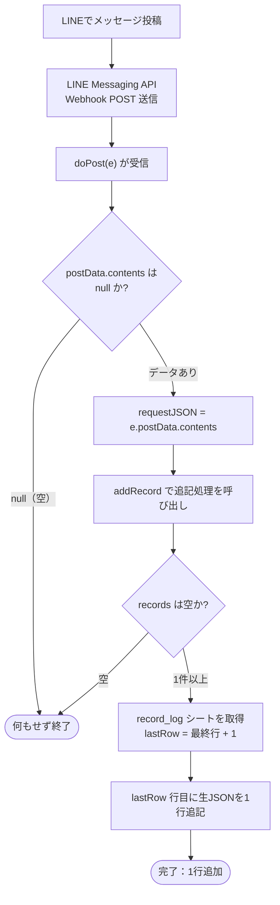
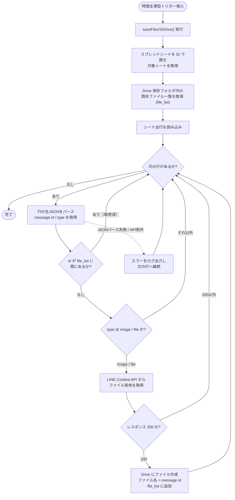

# LINE から Google Apps Scripts への連携 セットアップ手順

このフォルダのスクリプトは、LINE Messaging API から送られてくるメッセージを
**Google スプレッドシートに蓄積し、添付ファイル（画像・ファイル）を Google Drive に保存する**
ための仕組みです。ここで集めたデータが、後段の Python スクリプト
（`read_line_tsv.py` など）の入力になります。

---

## 全体の流れ

```
                LINE Messaging API
                       │  Webhook (POST)
                       ▼
        ┌────────────────────────────────┐
        │ LINE_message_webhook.gs         │  ← Web App として公開
        │  doPost() が生 JSON を受信       │
        └────────────────────────────────┘
                       │ 1 行 = 1 リクエストの生 JSON
                       ▼
        ┌────────────────────────────────┐
        │ スプレッドシート (record_log)    │
        └────────────────────────────────┘
                       │ 時間トリガー等で定期実行
                       ▼
        ┌────────────────────────────────┐
        │ DownloadFiles.gs                │
        │  画像・ファイルを LINE から取得  │
        └────────────────────────────────┘
                       │
                       ▼
        ┌────────────────────────────────┐
        │ Google Drive フォルダ            │  ← ファイル名 = message id
        └────────────────────────────────┘

   ── 後段（このリポジトリの Python 処理）──
   スプレッドシートを TSV エクスポート → read_line_tsv.py の入力
   Drive のファイルをダウンロード        → FILE_CACHE フォルダの入力
```

---

## スクリプトの役割

| ファイル | 役割 |
| --- | --- |
| `LINE_message_webhook.gs` | LINE の Webhook を受け取り、リクエストの生 JSON をスプレッドシートに 1 行ずつ追記する Web App。 |
| `DownloadFiles.gs` | スプレッドシートの各行を読み、画像・ファイルメッセージの実体を LINE Content API から取得して Drive に保存する。 |

---

## 1. 事前に用意するもの

* **LINE Developers アカウント**（Messaging API チャネル）
  * チャネルアクセストークン（長期）
    * 作成方法は LINE 公式ドキュメントを参照:
      [チャネルアクセストークン](https://developers.line.biz/ja/docs/basics/channel-access-token/)
* **Google アカウント**（スプレッドシート / Drive / Apps Script を利用）

---

## 2. スプレッドシートと Apps Script プロジェクトの作成

1. Google スプレッドシートを新規作成する。
2. シート名を **`record_log`** にする
   （`LINE_message_webhook.gs` の `SHEET_NAME` 定数と一致させること）。
3. メニューの **拡張機能 → Apps Script** を開く。
4. `LINE_message_webhook.gs` と `DownloadFiles.gs` の内容を
   Apps Script プロジェクトに貼り付ける。

---

## 3. Webhook 受信スクリプト（LINE_message_webhook.gs）

### 仕組み
* `doPost(e)` が LINE からの POST を受け取る。
* リクエストボディ（`e.postData.contents`）を**そのまま 1 セルに保存**する
  （パースせず生 JSON のまま蓄積するため、後段で柔軟に再解析できる）。
* `addRecord()` が `record_log` シートの最終行の下に追記する。

### フローチャート：スプレッドシートへの保存



### デプロイ手順
1. Apps Script エディタ右上の **デプロイ → 新しいデプロイ** を選択。
2. 種類で **ウェブアプリ** を選択。
3. 設定:
   * **実行するユーザー**: 自分
   * **アクセスできるユーザー**: **全員**（LINE サーバーから匿名で叩かれるため）
4. デプロイして発行される **ウェブアプリ URL** を控える。

### LINE 側の設定
1. LINE Developers コンソール → 対象チャネル → **Messaging API 設定**。
2. **Webhook URL** に、上で取得したウェブアプリ URL を設定。
3. **Webhook の利用**を ON にする。
4. 応答メッセージ等は用途に応じて OFF にする。

> グループのメッセージを記録したい場合は、対象の LINE グループに Bot を招待しておくこと。
> 以後、グループに投稿されたメッセージの Webhook が `record_log` に溜まっていく。

---

## 4. 添付ファイル取得スクリプト（DownloadFiles.gs）

### 仕組み
* `saveFilesToDrive()` が `record_log` の各行（生 JSON）を読む。
* `message.type` が **image / file** の行だけを対象に、
  `https://api-data.line.me/v2/bot/message/<id>/content` から実体を取得する。
* 取得したファイルを Drive フォルダに **メッセージ ID をファイル名として保存**する。
* 既に同名ファイルがあるものはスキップする（重複ダウンロード防止）。

### フローチャート：時間トリガーによる定期ダウンロード

「時間トリガー等で定期実行」される `saveFilesToDrive()` の処理は次のとおり。



### 設定（スクリプト冒頭のプレースホルダを置き換える）
```js
const SPREAD_SHEET_ID = '<SPREAD_SHEET_ID>'   // 対象スプレッドシートの ID
const SHEET_NAME      = '<SHEET_NAME>'        // 例: record_log
var   gFolder         = '<SAVE_FOLDER_ID>'    // 保存先 Drive フォルダの ID
const bearer_string   = "<BEARER STRING>"     // LINE チャネルアクセストークン
```

* **スプレッドシート ID / フォルダ ID** … URL 中の長い英数字部分。
* **BEARER STRING** … LINE のチャネルアクセストークン（`Bearer ` は付けず本体のみ）。
  作成方法は [チャネルアクセストークン（LINE 公式）](https://developers.line.biz/ja/docs/basics/channel-access-token/) を参照。

> ⚠️ トークンをコード内に直書きしている点に注意。共有・公開時は
> スクリプトプロパティ（`PropertiesService`）への移動を検討すること。

### 定期実行（トリガー設定）
1. Apps Script エディタ左の **トリガー（時計アイコン）** を開く。
2. **トリガーを追加**:
   * 実行する関数: `saveFilesToDrive`
   * イベントのソース: **時間主導型**
   * 例: 1 時間おき / 1 日おき など、運用に合わせて設定。

> LINE の添付ファイルは一定期間で取得できなくなるため、
> Webhook 受信から**なるべく早く**ダウンロードしておくのが安全。

---

## 5. 後段の Python 処理への受け渡し

ここで蓄積したデータは、次の形でリポジトリ側の処理に渡る。

1. **メッセージ本文（TSV）**
   `record_log` シートを **TSV としてエクスポート**（ファイル → ダウンロード → TSV、
   または該当列をコピー）し、`read_line_tsv.py` 等の入力にする。
   * グループ別に分割したい場合は `read_line_tsv_split_by_group.py` を使う。
2. **添付ファイル（キャッシュ）**
   Drive 上の保存フォルダをダウンロードし、`FILE_CACHE`（キャッシュフォルダ）として
   `read_line_tsv.py` に渡す。Drive に残っているため、LINE 側で取得不能になった
   ファイルもここから補完できる。

詳しい後段の実行手順は、リポジトリ直下の
[`LINE to Discord コピー手順.md`](LINE%20to%20Discord%20%E3%82%B3%E3%83%94%E3%83%BC%E6%89%8B%E9%A0%86.md)
を参照。

---

## 補足・注意点

* `record_log` には**生 JSON が 1 リクエスト = 1 行**で入る。1 リクエストに複数 event が
  含まれることがあるため、件数とメッセージ数は一致しないことがある。
* 同じメッセージが再送・重複することがあるため、後段で `message id` 単位の
  重複排除を行っている（`read_line_tsv.py`）。
* トークン・スプレッドシート ID・フォルダ ID は秘匿情報。リポジトリへコミットしないこと。
